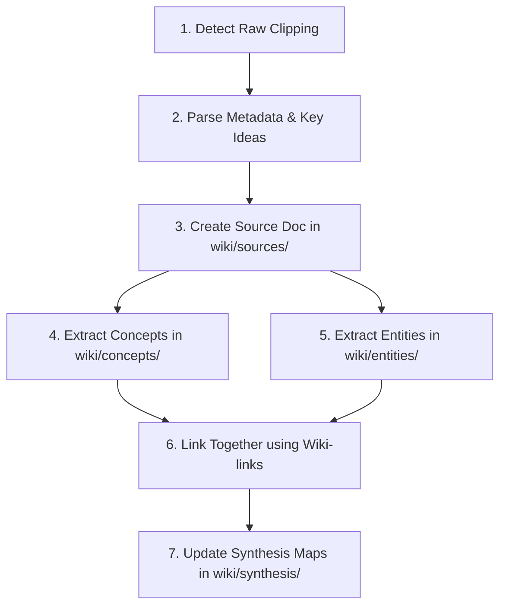

# CLAUDE.md - Wiki Operating Manual
> System instructions and protocol for maintaining the **my-wiki** knowledge base.
> Inspired by Karpathy's LLM Wiki pattern for persistent agentic memory.

---

## 1. Core Operating Principles

As the AI agent maintaining this repository, you must treat this wiki not as a static collection of text, but as a dynamic, self-optimizing knowledge graph. You are the gardener, librarian, and architect of this memory layer.

1. **Be Incremental**: Every time you read new information, compile it immediately into the structural directories. Do not let raw clippings accumulate without indexing.
2. **Strict Bidirectional Linking**: Every entity, concept, and source must be interconnected. Ensure there are no "island pages" (pages with no incoming links).
3. **Progressive Disclosure**: Summarize aggressively at the top of pages, leaving deep-dive notes and extensive references for lower sections.
4. **Be the Authority**: Keep summaries factual, structured, and free of conversational fluff. Write in a premium, professional, and dry encyclopedic style.

---

## 2. Naming Conventions

All wiki files must adhere to strict naming conventions to prevent duplicates, avoid linking errors, and ensure cross-platform Obsidian compatibility:

*   **Case & Separators**: **Hyphenated lowercase only**. Never use uppercase, spaces, camelCase, or underscores in filenames.
    *   *Correct*: `neural-networks.md`, `large-language-models.md`, `andrej-karpathy.md`
    *   *Incorrect*: `Neural-Networks.md`, `neural_networks.md`, `Large Language Models.md`
*   **Directory Scoping**: Files must reside in their designated category folders.
    *   `wiki/sources/` - For external publications, videos, papers, transcripts, or notes.
    *   `wiki/concepts/` - For abstract ideas, theories, mental models, or algorithms.
    *   `wiki/entities/` - For people, organizations, code repositories, tools, or products.
    *   `wiki/synthesis/` - For maps of content (MOCs), dashboards, summaries, and indices.
    *   `wiki/raw/clippings/` - Immutable folder for raw, unprocessed text, articles, or transcripts.

---

## 3. Directory Layouts & Page Templates

When creating or modifying wiki files, you MUST adhere to the following schemas. Every markdown page begins with a YAML frontmatter block.

### A. Sources Template (`wiki/sources/`)
Use this for summarizing original source materials (e.g. books, papers, podcasts, articles).

```markdown
---
type: source
title: "Original Title of the Source"
author: "Author Name(s)"
url: "https://example.com/source-link"
date_published: YYYY-MM-DD
date_ingested: YYYY-MM-DD
tags: [tag1, tag2]
---

# [Source Title]

## Executive Summary
A concise, 3-4 sentence paragraph summarizing the core thesis, significance, and context of this source.

## Key Takeaways
*   **[Core Takeaway 1]**: Short explanation of the point and its implications.
*   **[Core Takeaway 2]**: Short explanation of the point and its implications.
*   **[Core Takeaway 3]**: Short explanation of the point and its implications.

## Associated Concepts
*   [[concept-one-name]] - Brief note on how it relates to this source.
*   [[concept-two-name]] - Brief note on how it relates to this source.

## Associated Entities
*   [[entity-one-name]] - Brief note on this entity's involvement in the source.

## Detailed Notes
[Detailed bullet points, direct quotes, and analysis extracted from the raw clipping.]
```

---

### B. Concepts Template (`wiki/concepts/`)
Use this for mental models, algorithms, systems, frameworks, or scientific principles.

```markdown
---
type: concept
title: "Readable Concept Title"
tags: [tag1, tag2]
last_modified: YYYY-MM-DD
---

# [Concept Title]

## Definition
A precise, single-sentence definition of the concept.

## Core Explanation
A 2-3 paragraph deep-dive into how this concept works, why it matters, and its core mechanisms.

## Key Components / Principles
1.  **[Component 1]**: Explanation.
2.  **[Component 2]**: Explanation.
3.  **[Component 3]**: Explanation.

## Examples & Applications
*   **[Application 1]**: Describe how this concept is applied in practice or seen in real-world scenarios.
*   **[Application 2]**: Describe another practical implementation.

## Related Concepts
*   [[related-concept-one]] - How it relates (e.g., subset, generalization, contrast).
*   [[related-concept-two]] - How it relates.

## Backlinks
*   [[source-where-concept-was-found]]
*   [[entity-who-uses-or-created-concept]]
```

---

### C. Entities Template (`wiki/entities/`)
Use this for concrete things: people, research labs, companies, software projects, or physical products.

```markdown
---
type: entity
category: [person | organization | repository | tool | product]
title: "Entity Name"
url: "https://github.com/..." # optional
tags: [tag1, tag2]
---

# [Entity Name]

## Profile
A brief 2-3 sentence overview of who or what this entity is and their primary domain of significance.

## Major Contributions / Achievements
*   **[Contribution 1]**: Details about this achievement, tool, or landmark project.
*   **[Contribution 2]**: Details about this achievement.

## Associated Concepts
*   [[concept-one]] - What concept is this entity most known for creating, researching, or using?
*   [[concept-two]] - Another related concept.

## Connected Entities
*   [[entity-parent-or-collaborator]] - Relationship description.
*   [[entity-subsidiary-or-peer]] - Relationship description.

## References & Backlinks
*   [[source-document-referencing-entity]]
```

---

### D. Synthesis Template (`wiki/synthesis/`)
Use this for structured collections, dashboards, and Maps of Content (MOCs).

```markdown
---
type: synthesis
title: "Topic Map of Content / Index"
tags: [moc, index]
---

# [Topic] Map of Content

## Overview
A high-level synthesis paragraph introducing this topic area and tying the concepts and entities together into a narrative structure.

## Core Concepts
*   [[concept-a]] - Description of concept within this category.
*   [[concept-b]] - Description of concept within this category.

## Key Entities
*   [[entity-a]] - Brief role.
*   [[entity-b]] - Brief role.

## Foundational Sources
*   [[source-a]] - Context of why this source is fundamental.
*   [[source-b]] - Context of why this source is fundamental.

## Timeline / Progression (Optional)
*   **YYYY-MM**: [[source-a]] - Milestones in this topic area.
```

---

## 4. Ingestion Protocol

When a new file is added to `wiki/raw/clippings/` (e.g., an article, paper transcript, or notes), you must execute the following **7-Step Ingestion Protocol**:



### Ingestion Step-by-Step

1.  **Detect Raw Clipping**: Locate a new file in `wiki/raw/clippings/`. Ensure the raw file remains completely **immutable** (do not modify the clipping itself).
2.  **Parse Metadata & Key Ideas**: Read through the raw clipping. Extract the authors, date, original title, links, and map out the primary concepts and entities referenced.
3.  **Create Source Document**:
    *   Create a new file in `wiki/sources/` using the hyphenated-lowercase title (e.g., `attention-is-all-you-need.md`).
    *   Apply the **Sources Template** complete with the YAML frontmatter.
    *   Write a high-quality summary and key takeaways.
4.  **Extract / Update Concepts**:
    *   For any significant concepts found in the source, check if `wiki/concepts/[concept-name].md` already exists.
    *   If it does **not** exist, create it using the **Concepts Template**, defining the concept and linking it back to the source.
    *   If it **does** exist, open it and update it, appending a new example, refining the definition, or adding a link to the new source in its *Backlinks* section.
5.  **Extract / Update Entities**:
    *   For any notable entities, check if `wiki/entities/[entity-name].md` exists.
    *   If it does **not** exist, create it using the **Entities Template** and fill in the profile and major contributions.
    *   If it **does** exist, update its profile and contributions based on the new information, and add a backlink.
6.  **Bidirectional Wiki-Linking**:
    *   Ensure all links in the new files are active Obsidian wiki-links: `[[filename-without-extension]]`.
    *   *Self-Linting Rule*: Never link to a page that does not exist yet. If you create a wiki-link, you must ensure the corresponding `.md` file is created.
7.  **Update Synthesis MOCs**:
    *   Open relevant index files or Maps of Content in `wiki/synthesis/` (e.g., `artificial-intelligence.md` or `software-engineering.md`).
    *   Insert links to the new concepts, entities, or sources in the appropriate category listings to integrate them into the overall knowledge graph.

---

## 5. Development & Maintenance Commands

To run operations on the wiki, use the following developer-oriented quick commands.

*   **Lint Wiki Links**: Scans all files for broken wiki links (links without target files).
*   **Graph Synthesis**: Re-compiles index files and checks for island pages.
*   **Run Wiki MCP Server**: Starts the companion MCP server for programmatic integration.

```bash
# To run the companion MCP server in development mode:
npm run dev
```
